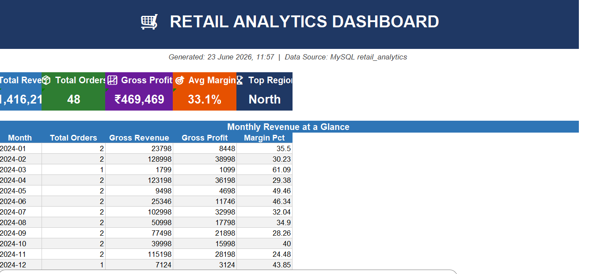
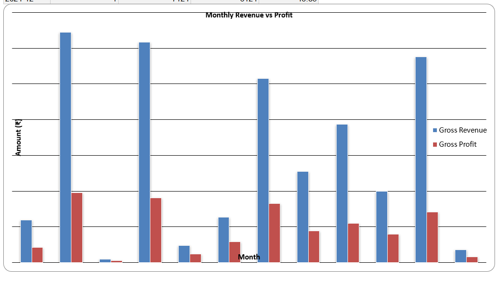

# 🛒 Retail Analytics — MySQL + Python + Excel + Power BI


An industry-grade end-to-end retail analytics system with:
- MySQL star-schema database (1250+ orders, 30 customers, 20 products)
- Python ETL pipeline with data validation
- Auto-generated Excel dashboard (9 sheets, charts, KPI cards)
- Power BI live dashboard connected to MySQL
- Weekly auto-scheduler (runs every Monday 8AM)
- GitHub CI/CD ready

## 📸 Dashboard Preview



## 📁 Project Structure
```
Retail_Analytics/
├── sql/
│   ├── schema/
│   │   ├── 01_create_database.sql
│   │   └── 02_seed_data.sql
│   ├── queries/
│   │   └── 03_analytics_queries.sql
│   └── stored_procedures/
│       └── 04_stored_procedures.sql
├── scripts/
│   ├── 05_generate_excel.py
│   ├── 06_generate_data.py
│   ├── 07_validate_data.py
│   └── 08_scheduler.py
├── powerbi/
│   └── 
├── reports/
│   └── retail_analytics_dashboard.xlsx
├── logs/
├── images/
├── .env
├── .gitignore
├── requirements.txt
└── README.md
```

## 🗄️ Database Schema
- 9 tables (Star Schema: 5 dimension + 4 fact)
- 30 customers across 5 regions
- 20 products across 6 categories
- 1250+ orders (2022–2024)
- Seasonal data patterns (Diwali, festive sales)

## 📊 Analytics Covered
- Customer Lifetime Value (CLV)
- RFM Segmentation (Recency, Frequency, Monetary)
- Year-over-Year Growth (LAG window function)
- Sales Rep Leaderboard (RANK window function)
- Regional & Category Breakdown
- Return Rate Analysis
- Payment Method Distribution
- Monthly Revenue, COGS & Gross Profit

